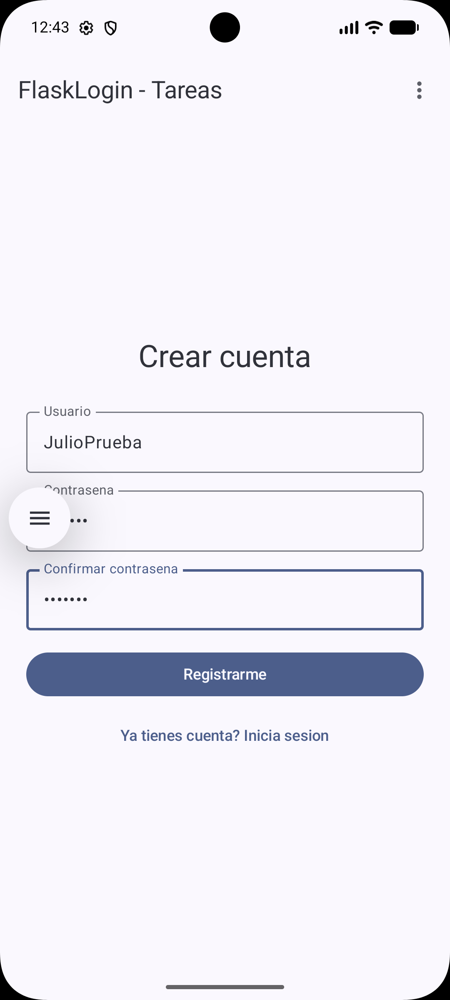
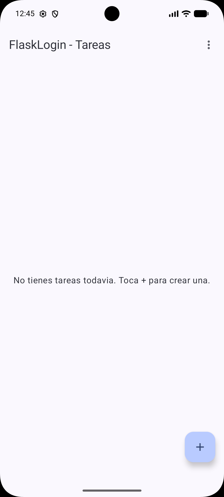
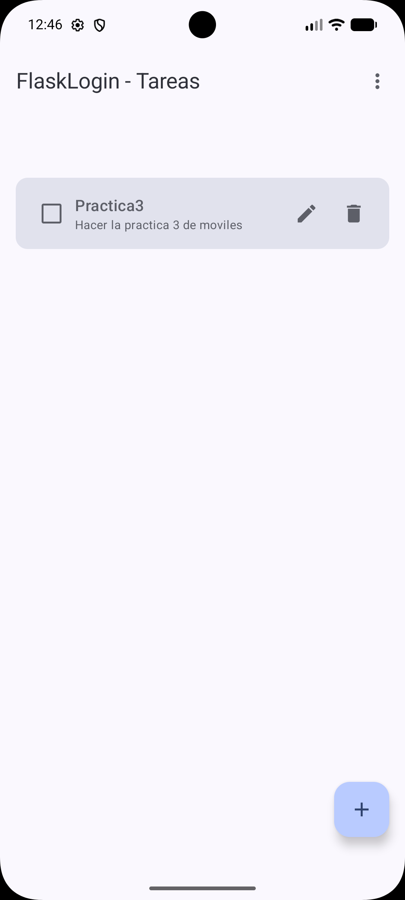
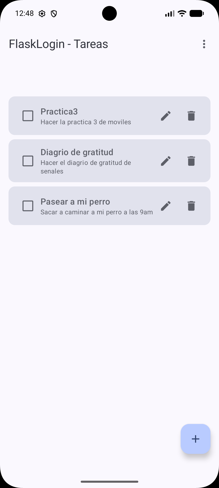
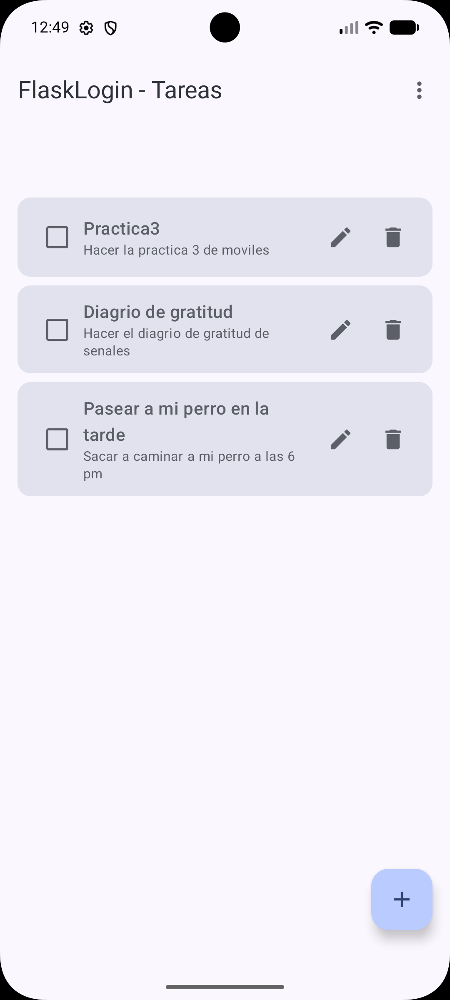
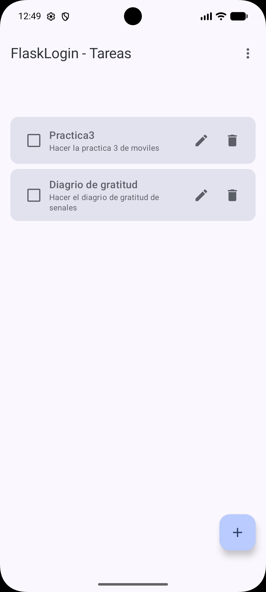
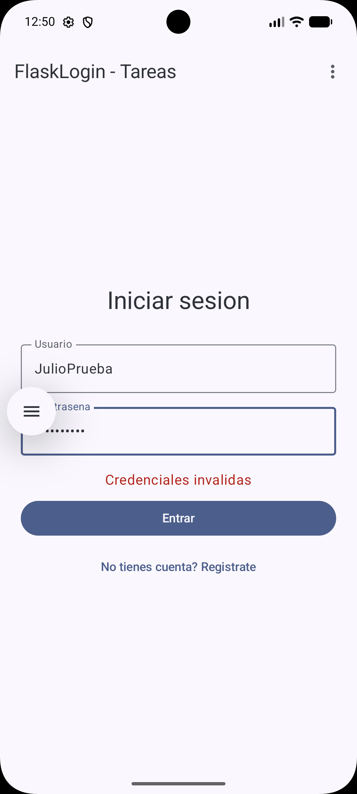

# Práctica 2: Aplicación móvil básica para operaciones CRUD con un servicio REST

## Portada

- **Nombre completo:** Julio Cesar Reyes Olascoaga
- **Número de boleta:** 2024630433
- **Grupo:** 7CV4
- **Asignatura:** Desarrollo de aplicaciones móviles nativas
- **Profesor:** Gabriel Hurtado Avilés
- **Fecha de entrega:** 18 de septiembre de 2026

---

## Introducción

Esta práctica consiste en una aplicación móvil Android que consume un servicio REST propio para realizar operaciones CRUD (Crear, Leer, Actualizar, Borrar) sobre el recurso **Tarea**, además de un sistema de autenticación (registro e inicio de sesión) con contraseñas encriptadas y sesiones seguras basadas en JSON Web Tokens (JWT).

El proyecto se construyó **a partir del repositorio de ejemplo** [`Flask-Compose-Login-API`](https://github.com/gabrielhuav/Flask-Compose-Login-API) proporcionado por el profesor. El ejemplo únicamente traía el registro y el login básicos (sin sesiones ni CRUD) en el backend, y una app Android en blanco (solo un "Hello Android") sin ninguna pantalla ni lógica de red. A partir de esa base se agregó todo lo siguiente:

**Backend (`Docker-Flask/ORM/`):**
- Modelo `Tarea` (SQLAlchemy) y los cuatro endpoints CRUD (`GET`, `POST`, `PUT`, `DELETE` sobre `/tareas`).
- Autenticación basada en JWT con la librería `Flask-JWT-Extended`: el `/login` ahora devuelve un `access_token` firmado con expiración, y todos los endpoints de `/tareas` están protegidos con `@jwt_required()`.
- Manejo de variables de entorno (`.env` / `.env.example`) para la llave secreta del token, en vez de dejarla escrita en el código.
- Manejadores de error personalizados para que cualquier endpoint protegido responda **401** cuando no hay una sesión válida.

**Aplicación Android (`Android/FlaskLogin/`):**
- Menú de navegación (desplegable) con las opciones Inicio de sesión, Registro de usuario y Operaciones CRUD.
- Pantallas de **Login** y **Registro** conectadas al backend con Retrofit + OkHttp.
- Pantalla de **Tareas** con las cuatro operaciones CRUD (lista, crear, editar, marcar como completada, borrar).
- Persistencia local del token de sesión con **DataStore**, para que la sesión sobreviva a que se cierre la app.
- Manejo explícito de los estados de carga, error y sesión iniciada en cada pantalla.

### Stack elegido y justificación

| Capa | Tecnología | Justificación |
|---|---|---|
| Backend | Flask + Flask-SQLAlchemy + Flask-Bcrypt + Flask-JWT-Extended | Es el stack que trae el repositorio de ejemplo; se mantuvo por ser ligero, fácil de dockerizar y suficiente para el alcance de la práctica. Flask-JWT-Extended añade sesiones firmadas con expiración sin tener que implementar JWT a mano. |
| Base de datos | SQLite (vía SQLAlchemy) | No requiere un servidor de base de datos externo; el archivo se crea automáticamente al iniciar el contenedor, ideal para un entorno de práctica reproducible con un solo comando. |
| Contenedores | Docker + Docker Compose | Permite levantar el backend con un único comando (`docker compose up --build`) en cualquier equipo que solo tenga Docker instalado. |
| App móvil | Kotlin + Jetpack Compose (Material 3) | Es el proyecto base entregado por el profesor y el estándar actual recomendado por Google para UI declarativa en Android. |
| Cliente HTTP | Retrofit + OkHttp + Gson | Es el cliente HTTP más usado en el ecosistema Android para consumir APIs REST, con soporte nativo para corrutinas (`suspend fun`). |
| Navegación | Navigation-Compose | Permite manejar las pantallas (login, registro, tareas) como un grafo de navegación dentro de Compose. |
| Persistencia de sesión | DataStore Preferences | Reemplazo moderno de `SharedPreferences` recomendado por Android Jetpack para guardar el token de forma asíncrona. |

---

## Desarrollo

### Conceptos del Ejercicio 2 (explicados con nuestras palabras)

- **Docker:** es una herramienta que empaqueta una aplicación junto con todo lo que necesita para funcionar (el intérprete de Python, las librerías, el código y la configuración) dentro de una unidad llamada *contenedor*. A diferencia de una máquina virtual completa, un contenedor comparte el núcleo del sistema operativo del equipo anfitrión, por lo que se levanta en segundos en lugar de minutos. Esto resuelve el clásico problema de "en mi máquina sí funciona", porque el contenedor se ejecuta igual en cualquier equipo que tenga Docker instalado.

- **Imagen y contenedor:** la *imagen* es como una plantilla o "foto" congelada de todo lo que necesita la aplicación (dependencias, código, configuración) y no cambia una vez construida. El *contenedor* es la instancia en ejecución de esa imagen; es efímero, es decir, si se borra se pierde lo que haya cambiado dentro de él en tiempo de ejecución (por eso la base de datos se guarda fuera, sincronizada con la carpeta del proyecto mediante un volumen).

- **Dockerfile:** es un archivo de texto plano con instrucciones que Docker sigue, en orden, para construir la imagen. En este proyecto: `FROM python:3.9-slim` (parte de una imagen base ligera de Python), `WORKDIR /app` (carpeta de trabajo dentro del contenedor), `COPY requirements.txt .` y `RUN pip install ...` (instala dependencias, separado del resto del código para aprovechar la caché de Docker), `COPY . .` (copia el resto del código), `EXPOSE 5000` (documenta el puerto que usa el servicio) y `CMD ["python", "app.py"]` (comando que se ejecuta al iniciar el contenedor).

- **docker-compose.yml:** en vez de escribir comandos largos de `docker run` con todos sus parámetros, este archivo YAML describe la aplicación como uno o varios "servicios" (en este caso solo `web`), indicando cómo construir su imagen, qué puertos publicar, qué volúmenes montar y qué variables de entorno usar. Con `docker compose up --build` se construye la imagen y se levanta el contenedor con un solo comando.

- **Backend o servicio REST:** es el programa que corre del lado del servidor (en este caso, dentro del contenedor) y expone la lógica de negocio como rutas HTTP. Recibe peticiones con los verbos `GET`, `POST`, `PUT` y `DELETE`, valida los datos recibidos, consulta o modifica la base de datos a través del ORM, y responde en formato JSON junto con un código de estado HTTP que indica si la operación tuvo éxito o no.

- **ORM y base de datos:** un ORM (*Object-Relational Mapper*), en este caso SQLAlchemy, permite trabajar con las tablas de la base de datos como si fueran clases y objetos de Python (`User`, `Tarea`), en lugar de escribir sentencias SQL directamente. Aquí se usa SQLite, que guarda toda la información en un único archivo local (`site.db`), lo cual es suficiente para esta práctica porque no requiere levantar un servidor de base de datos aparte.

### Documentación de los endpoints

Base URL local: `http://localhost:5000/` (desde el equipo anfitrión) o `http://10.0.2.2:5000/` (desde el emulador de Android).

#### `GET /`
Verifica que el servicio esté corriendo. No requiere autenticación.

Respuesta `200 OK`:
```json
{ "message": "API Funcionando" }
```

#### `POST /register`
Registra un nuevo usuario. La contraseña se guarda hasheada con bcrypt.

Body:
```json
{ "username": "julio", "password": "12345678" }
```

Respuesta `201 Created`:
```json
{ "message": "Usuario creado exitosamente" }
```

Respuesta `400 Bad Request` (usuario ya existe o faltan campos):
```json
{ "message": "El usuario ya existe" }
```

#### `POST /login`
Verifica las credenciales y, si son correctas, devuelve un token JWT.

Body:
```json
{ "username": "julio", "password": "12345678" }
```

Respuesta `200 OK`:
```json
{
  "status": "success",
  "message": "Login exitoso",
  "access_token": "eyJhbGciOiJIUzI1NiIsInR5cCI6IkpXVCJ9...",
  "user_id": 1,
  "username": "julio"
}
```

Respuesta `401 Unauthorized` (credenciales inválidas):
```json
{ "status": "error", "message": "Credenciales inválidas" }
```

A partir de aquí, todos los endpoints requieren el encabezado:
`Authorization: Bearer <access_token>`

#### `GET /tareas`
Lista las tareas del usuario autenticado.

Respuesta `200 OK`:
```json
[
  { "id": 1, "titulo": "Estudiar", "descripcion": "Repasar temas 1-3", "completada": false }
]
```

Respuesta `401 Unauthorized` (sin token o token inválido/expirado):
```json
{ "status": "error", "message": "Se requiere iniciar sesión" }
```

#### `POST /tareas`
Crea una nueva tarea para el usuario autenticado.

Body:
```json
{ "titulo": "Estudiar", "descripcion": "Repasar temas 1-3", "completada": false }
```

Respuesta `201 Created`:
```json
{ "id": 1, "titulo": "Estudiar", "descripcion": "Repasar temas 1-3", "completada": false }
```

Respuesta `400 Bad Request` (falta el título):
```json
{ "message": "El campo 'titulo' es obligatorio" }
```

#### `PUT /tareas/<id>`
Actualiza una tarea existente del usuario autenticado (acepta actualización parcial).

Body (ejemplo, marcar como completada):
```json
{ "completada": true }
```

Respuesta `200 OK`:
```json
{ "id": 1, "titulo": "Estudiar", "descripcion": "Repasar temas 1-3", "completada": true }
```

Respuesta `404 Not Found`:
```json
{ "message": "Tarea no encontrada" }
```

#### `DELETE /tareas/<id>`
Elimina una tarea del usuario autenticado.

Respuesta `200 OK`:
```json
{ "message": "Tarea eliminada" }
```

Respuesta `404 Not Found`:
```json
{ "message": "Tarea no encontrada" }
```

> Más ejemplos de uso con `curl` están en [`Docker-Flask/ORM/curl.txt`](Docker-Flask/ORM/curl.txt).

### Instalación y ejecución del backend

1. Clonar el repositorio y ubicarse en la carpeta del backend:
   ```bash
   git clone https://github.com/Julio-Olascoaga/Practica_2_Aplicaci-n_m-vil_b-sica.git
   cd Practica_2_Aplicaci-n_m-vil_b-sica/Docker-Flask/ORM
   ```
2. Crear el archivo de variables de entorno a partir del ejemplo y editar la llave secreta:
   ```bash
   cp .env.example .env
   # Edita .env y cambia JWT_SECRET_KEY por una llave aleatoria propia
   ```
3. Levantar el servicio (requiere únicamente tener Docker instalado):
   ```bash
   docker compose up --build
   ```
4. Verificar que el servicio esté arriba entrando a `http://localhost:5000/` o con:
   ```bash
   curl http://localhost:5000/
   ```

El backend queda escuchando en el puerto `5000` del equipo anfitrión. El archivo `site.db` se crea automáticamente dentro del contenedor la primera vez que se levanta.

### Configuración y ejecución de la app Android

1. Abrir la carpeta `Android/FlaskLogin` en Android Studio.
2. Revisar la URL base en `app/src/main/java/ovh/gabrielhuav/flasklogin/data/network/RetrofitClient.kt`:
   - **Emulador de Android Studio:** se deja `http://10.0.2.2:5000/` (ya viene configurado así). La dirección `10.0.2.2` es la forma en que el emulador ve al `localhost` del equipo anfitrión; usar `localhost` directamente **no** funciona porque dentro del emulador apuntaría al propio emulador.
   - **Dispositivo físico en la misma red Wi-Fi:** cambiar `BASE_URL` por la IP local del equipo, por ejemplo `http://192.168.1.50:5000/`.
3. Ejecutar la app en un emulador (minSdk 24) con el backend ya levantado (paso anterior).
4. Permiso `INTERNET` y `usesCleartextTraffic="true"` ya están declarados en `AndroidManifest.xml` para poder consumir la API por HTTP sin TLS durante el desarrollo.

### QA: verificación de seguridad

Checklist de pruebas manuales realizadas antes de la entrega (marcar con [x] las que ya se ejecutaron):

- [ ] Las contraseñas se guardan hasheadas: al inspeccionar `site.db` (por ejemplo con `sqlite3 site.db "SELECT username, password FROM user;"` dentro del contenedor) el campo `password` nunca aparece en texto plano, siempre como hash de bcrypt (`$2b$...`).
- [ ] `GET /tareas` sin encabezado `Authorization` responde `401`.
- [ ] `GET /tareas` con un token inválido o mal formado responde `401`.
- [ ] `POST /login` con credenciales incorrectas responde `401` y no revela si el usuario existe o no.
- [ ] `POST /register` con un usuario ya existente responde `400` y no crea un registro duplicado.
- [ ] Las cuatro operaciones CRUD (`POST`, `GET`, `PUT`, `DELETE` sobre `/tareas`) funcionan correctamente con un token válido.
- [ ] No hay credenciales, llaves ni secretos escritos directamente en el código fuente ni subidos al repositorio (`.env` está en `.gitignore`; solo se sube `.env.example`).

> Julio: marca cada casilla conforme la vayas verificando con `curl`/Postman y en la app; esto documenta el proceso de QA que pide la rúbrica.

### Capturas de pantalla

> Coloca aquí las capturas pedidas por la práctica (regístralas en la carpeta `docs/` con estos nombres, o ajusta los nombres si prefieres otros, y las imágenes se verán automáticamente en este README).

| Flujo | Captura |
|---|---|
| Registro de usuario |  |
| Inicio de sesión exitoso |  |
| Crear tarea (POST) |  |
| Listar tareas (GET) |  |
| Actualizar tarea (PUT) |  |
| Borrar tarea (DELETE) |  |
| Credenciales incorrectas |  |

---

## Conclusiones

> **Pendiente de personalizar por Julio después de probar la app en el emulador.** Sugerencia de estructura (bórrala o reescríbela con tu experiencia real):
>
> - Principales retos técnicos que encontraste (por ejemplo: configurar `10.0.2.2` para que el emulador alcance el backend, manejar el token JWT entre pantallas, o el manejo de estados de carga/error en Compose).
> - Qué lograste completar y qué tan bien cumple con lo pedido en la especificación.
> - Dificultades específicas y cómo las resolviste (mensajes de error que viste, qué revisaste, qué cambiaste).

---

## Bibliografía

Docker Inc. (2024). *Docker documentation*. Docker. https://docs.docker.com/

Docker Inc. (2024). *Docker Compose overview*. Docker. https://docs.docker.com/compose/

Pallets Projects. (2024). *Flask documentation*. https://flask.palletsprojects.com/

SQLAlchemy authors. (2024). *Flask-SQLAlchemy documentation*. https://flask-sqlalchemy.palletsprojects.com/

Ledesma, D. (2024). *Flask-JWT-Extended documentation*. https://flask-jwt-extended.readthedocs.io/

Google. (2024). *Jetpack Compose documentation*. Android Developers. https://developer.android.com/jetpack/compose

Google. (2024). *Navigation with Compose*. Android Developers. https://developer.android.com/jetpack/compose/navigation

Google. (2024). *Preferences DataStore*. Android Developers. https://developer.android.com/topic/libraries/architecture/datastore

Square Inc. (2024). *Retrofit documentation*. https://square.github.io/retrofit/

Square Inc. (2024). *OkHttp documentation*. https://square.github.io/okhttp/
